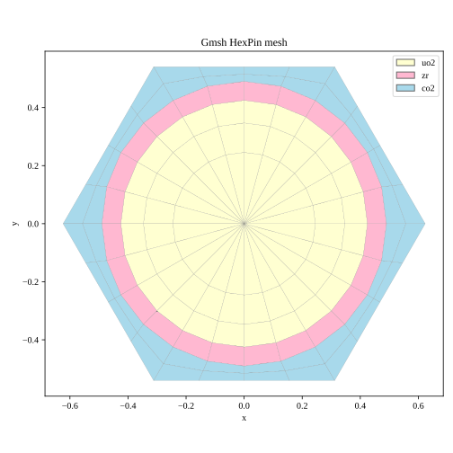
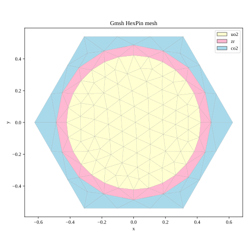
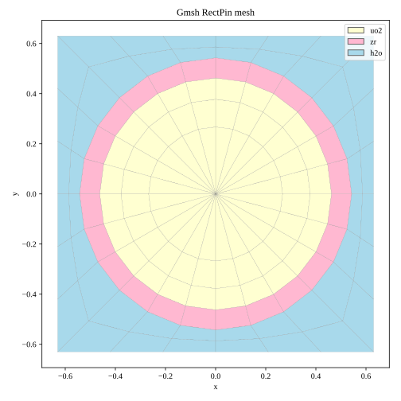
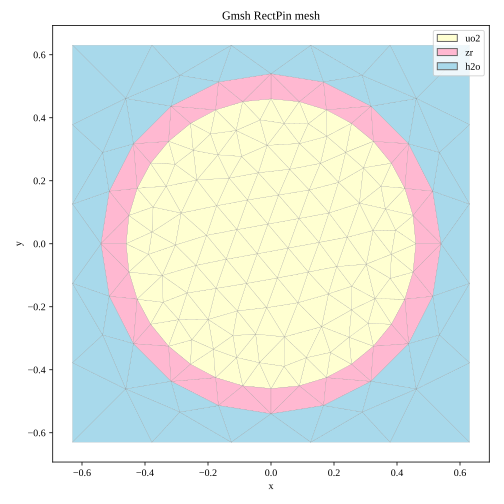

# SMRT

**SMRT** stands for **Simple MOC Ray-Tracing**. It is a Gmsh-based preprocessing tool for two-dimensional Method of Characteristics (MOC) neutron transport calculations.

The software generates two-dimensional computational meshes and ray tracking information for use with the **ALPHA neutron lattice physics code** developed by the ALPHA Group, Nuclear Reactor Physics, School of Physics, Zhejiang University. SMRT does **not** include the neutron transport solver itself. ALPHA reads the generated `.trk` file, stores the mesh and ray tracking data in arrays, and performs the MOC calculation.

| Item | Information                                                                         |
| --- |-------------------------------------------------------------------------------------|
| Version | 0.1.0 (initial release)                                                             |
| Release date | 2026-09-17                                                                          |
| Author | CaoWei                                                                              |
| Development | ALPHA Reactor Team, Zhejiang Institute of Modern Physics, School of Physics, Zhejiang University, Hangzhou |
| Supported platforms | Windows and Linux                                                                   |
| Reference environment | Python 3.12.3                                                                       |

Repository: [github.com/MustardSalmon/SMRT](https://github.com/MustardSalmon/SMRT)

## Current scope

The initial open-source release supports:

- square pin-cell geometries;
- hexagonal pin-cell geometries;
- structured mesh generation;
- automatic Gmsh mesh generation;
- material-region identification;
- ray tracking generation for multiple azimuthal directions;
- full-cell and one-sixth symmetric tracking for supported hexagonal cases;
- export of ALPHA-compatible ray tracking data.

The current release is limited to square and hexagonal pin-cell examples. More complex geometry-generation modules have already been developed and will be released in future versions.

## Computational workflow

1. Define the materials and their order in a Python input card.
2. Build a square or hexagonal pin-cell geometry with `GmshGeometryModeling`.
3. Generate a structured or automatic Gmsh mesh and save it as `.msh`.
4. Read the mesh with `RayTracing.GmshParser`.
5. Generate characteristic lines for the requested azimuthal directions.
6. Export the mesh-region and ray tracking information as an ALPHA `.trk` file.
7. Use the `.trk` file as input to ALPHA for the MOC neutron transport calculation.

## Repository structure

```text
SMRT/
├── Driver/                  # Track-file export and transport data structures
├── GmshGeometryModeling/    # Materials, pin-cell geometry, mesh generation, and plotting
├── RayTracing/              # Gmsh parsing and ray tracking generation
├── examples/
│   ├── HexPinAutomatic/
│   ├── HexPinStructured/
│   ├── RectPinAutomatic/
│   └── RectPinStructured/
├── docs/
│   ├── ALPHA_Interface.md
│   ├── FileFormats.md
│   └── References.md
├── LICENSE
├── requirements.txt
├── CITATION.cff
├── .gitignore
├── CONTRIBUTING.md
└── CHANGELOG.md
```

## Installation

SMRT is currently distributed as a source repository. Create a Python environment and install the required packages:

```powershell
python -m venv .venv
.\.venv\Scripts\activate
python -m pip install --upgrade pip
python -m pip install -r requirements.txt
```

On Linux, activate the environment with:

```bash
source .venv/bin/activate
```

The reference development environment uses Python 3.12.3. SciPy is included in the reference requirements for accelerated spatial searches; the code also retains a NumPy fallback when SciPy is unavailable.

## Running an example

Each example is an independent input-card directory. Run the geometry/mesh generation first and then the ray tracking:

```powershell
cd examples/HexPinStructured
python model.py
python tracking.py
```

The same workflow is available in the following examples:

- [HexPinStructured](examples/HexPinStructured/README.md)
- [HexPinAutomatic](examples/HexPinAutomatic/README.md)
- [RectPinStructured](examples/RectPinStructured/README.md)
- [RectPinAutomatic](examples/RectPinAutomatic/README.md)

The model step generates a `.msh` mesh and an `.svg` visualization. The tracking step generates an ALPHA `.trk` file.

The `.trk` files included with the current examples have been successfully read by ALPHA.

## Example mesh visualizations

The following figures are generated directly from the four public test cases. Click a figure to open the corresponding example directory.

| HexPin — Structured | HexPin — Automatic |
| --- | --- |
| [](examples/HexPinStructured/) | [](examples/HexPinAutomatic/) |

| RectPin — Structured | RectPin — Automatic |
| --- | --- |
| [](examples/RectPinStructured/) | [](examples/RectPinAutomatic/) |

## Input and output formats

- `.msh`: native Gmsh mesh file containing mesh-format information, physical groups, nodes, elements, and—depending on the MSH version—geometry/topology metadata.
- `.trk`: SMRT's ALPHA text-format output containing material-region information, region areas, azimuthal parameters, ray tracking data, segment lengths, swept regions, and reflection/continuation identifiers.

For the detailed file descriptions, see [FileFormats.md](docs/FileFormats.md) and [ALPHA_Interface.md](docs/ALPHA_Interface.md).

## Material and coordinate conventions

Material IDs in the SMRT/ALPHA track data are assigned from zero in the order in which `Material.Material` objects are placed in the material list. For example:

```python
materials = Material.Materials([uo2, zr, h2o])
```

defines `uo2 -> 0`, `zr -> 1`, and `h2o -> 2` for the track-file material IDs. The geometric center of the pin cell is always `(0, 0)`.

## Publications

The scientific publications associated with the development and application of the methods are listed in [References.md](docs/References.md). Please cite both the relevant scientific publication and the SMRT software release when using this repository in published work.

## License

SMRT is released under the [MIT License](LICENSE). Third-party software, including Gmsh and Python dependencies, remains subject to its own license terms.
